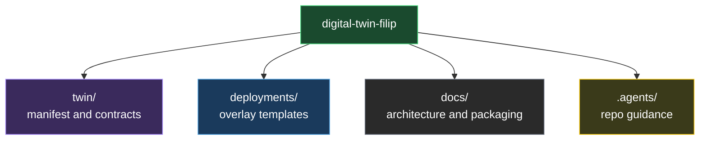
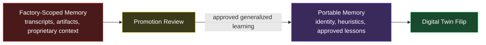

# Architecture

## Purpose

Describe the package structure and memory boundaries for `digital-twin-filip`.

## Package Structure

<!-- DIAGRAM: twin-package-structure START -->

<!-- DIAGRAM: twin-package-structure END -->

## Memory Boundary

<!-- DIAGRAM: twin-memory-boundary START -->

<!-- DIAGRAM: twin-memory-boundary END -->

## Narrative Summary

This repo defines the portable twin, not the runtime platform.

The twin package should carry:

- identity
- capability contracts
- portable memory policy
- deployment overlay templates

The twin package should not carry:

- raw factory memory
- customer artifacts
- factory transcripts
- secrets

## Update Rule

When package structure or memory rules change:

1. update the diagram source in `diagrams/`
2. run `python3 scripts/embed_diagrams.py`
3. update the relevant `twin/` contract files
